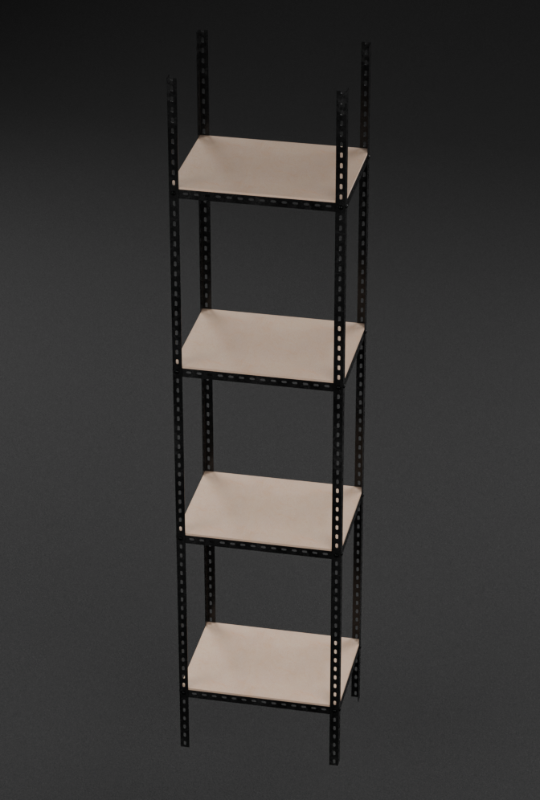

# Workshop Rack

## Overview

This repository contains design files for a compact 45×35×2000 mm workshop rack with four shelves. It is designed to fit into tight spaces and hold lightweight items.

The rack is constructed from 25×25×1.2 mm steel angle bars, with 6 mm plywood used for the shelves. The angle bars are fastened together using M5 bolts.

